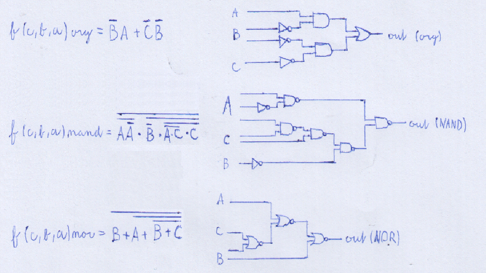
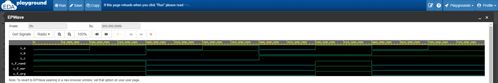
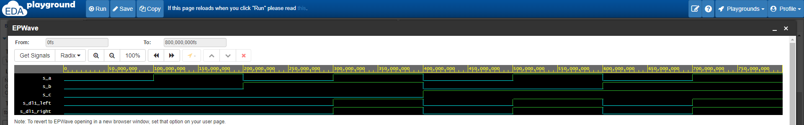

# Lab 1: Marek Černý, 230235

### De Morgan's laws

1. Equations of all three versions of logic function f(c,b,a):

   

2. Listing of VHDL architecture from design file (`design.vhd`) for all three functions. Always use syntax highlighting, meaningful comments, and follow VHDL guidelines:

```vhdl
architecture dataflow of demorgan is
begin
    f_org_o  <= ((not(b_i) and a_i) or (not(c_i) and not(b_i)));
    f_nand_o <= ((a_i nand not a_i) nand (not b_i nand ((a_i nand c_i) nand c_i)));
    f_nor_o  <= (b_i nor(a_i nor (b_i nor c_i)));
end architecture dataflow;
```

3. Complete table with logic functions' values:

| **c** | **b** |**a** | **f(c,b,a)_ORG** | **f(c,b,a)_NAND** | **f(c,b,a)_NOR** |
| :-: | :-: | :-: | :-: | :-: | :-: |
| 0 | 0 | 0 | 1 | 1 | 1 |
| 0 | 0 | 1 | 1 | 1 | 1 |
| 0 | 1 | 0 | 0 | 0 | 0 |
| 0 | 1 | 1 | 0 | 0 | 0 |
| 1 | 0 | 0 | 0 | 0 | 0 |
| 1 | 0 | 1 | 1 | 1 | 1 |
| 1 | 1 | 0 | 0 | 0 | 0 |
| 1 | 1 | 1 | 0 | 0 | 0 |



### Distributive laws

1. Screenshot with simulated time waveforms. Always display all inputs and outputs (display the inputs at the top of the image, the outputs below them) at the appropriate time scale!   

```vhdl
architecture dataflow of demorgan is
begin
   f_DL1_left  <= ((a_i and b_i) or (a_i and c_i));
   f_DL1_right <= (a_i and (b_i or c_i));    
   f_DL2_left  <= ((a_i or b_i) and (a_i or c_i));
   f_DL2_right <= (a_i or (b_i and c_i));
end architecture dataflow;
```

 First distributive law
   
 
 Second distributive law
   

2. Link to your public EDA Playground example:

   [https://www.edaplayground.com/x/h27C](https://www.edaplayground.com/x/h27C)
