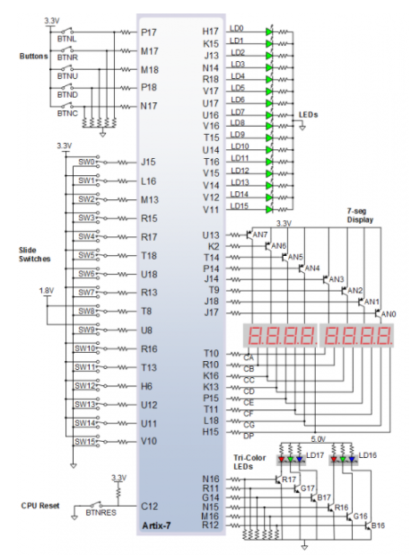
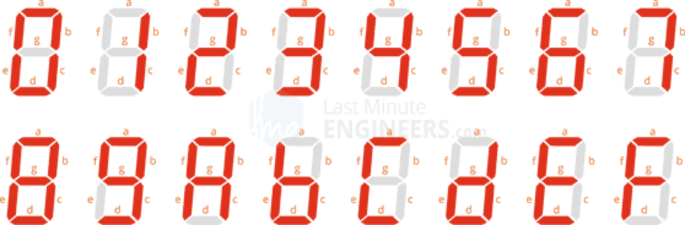
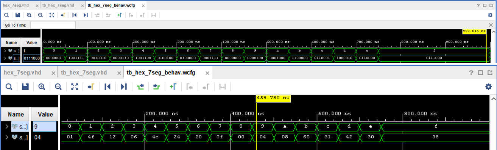
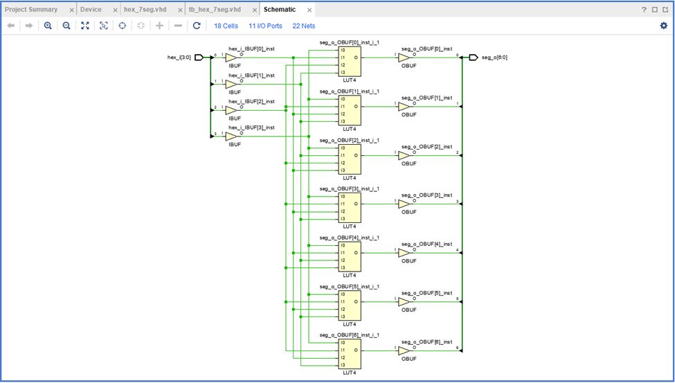
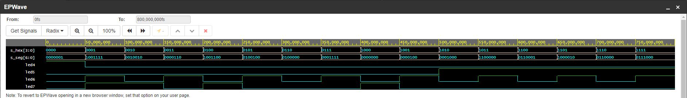

# Lab 4: Marek Černý, 230235

## Preparation tasks (done before the lab at home)

The Nexys A7 board provides two four-digit common anode seven-segment LED displays (configured to behave like a single eight-digit display).

1. See [schematic](https://github.com/tomas-fryza/digital-electronics-1/blob/master/Docs/nexys-a7-sch.pdf) or [reference manual](https://reference.digilentinc.com/reference/programmable-logic/nexys-a7/reference-manual) of the Nexys A7 board and find out the connection of 7-segment displays, ie to which FPGA pins are connected and how.



2. Complete the decoder truth table for **common anode** 7-segment display.

   | **Hex** | **Inputs** | **A** | **B** | **C** | **D** | **E** | **F** | **G** |
   | :-: | :-: | :-: | :-: | :-: | :-: | :-: | :-: | :-: |
   | 0 | 0000 | 0 | 0 | 0 | 0 | 0 | 0 | 1 |
   | 1 | 0001 | 1 | 0 | 0 | 1 | 1 | 1 | 1 |
   | 2 | 0010 | 0 | 0 | 1 | 0 | 0 | 1 | 0 |
   | 3 | 0011 | 0 | 0 | 0 | 0 | 1 | 1 | 0 |
   | 4 | 0100 | 1 | 0 | 0 | 1 | 1 | 0 | 0 |
   | 5 | 0101 | 0 | 1 | 0 | 0 | 1 | 0 | 0 |
   | 6 | 0110 | 0 | 1 | 0 | 0 | 0 | 0 | 0 |
   | 7 | 0111 | 0 | 0 | 0 | 1 | 1 | 1 | 1 |
   | 8 | 1000 | 0 | 0 | 0 | 0 | 0 | 0 | 0 |
   | 9 | 1001 | 0 | 0 | 0 | 0 | 1 | 0 | 0 |
   | A | 1010 | 0 | 0 | 0 | 1 | 0 | 0 | 0 |
   | b | 1011 | 1 | 1 | 0 | 0 | 0 | 0 | 0 |
   | C | 1100 | 0 | 1 | 1 | 0 | 0 | 0 | 1 |
   | d | 1101 | 1 | 0 | 0 | 0 | 0 | 1 | 0 |
   | E | 1110 | 0 | 1 | 1 | 0 | 0 | 0 | 0 |
   | F | 1111 | 0 | 1 | 1 | 1 | 0 | 0 | 0 |

   

    > The image above was used from website: [How Seven Segment Display Works & Interface it with Arduino](https://lastminuteengineers.com/seven-segment-arduino-tutorial/).
    >

<a name="part1"></a>

### Seven-segment display decoder

1. Listing of VHDL stimulus process from testbench file (`tb_hex_7seg.vhd`) with asserts. Verify all input combinations. Always use syntax highlighting, meaningful comments, and follow VHDL guidelines:

```vhdl
    p_stimulus : process
    begin
    
        report "Stimulus process started" severity note;

        s_hex <= "0000"; wait for 50 ns;
        assert (s_seg = "0000001")        
        report "Input combination 0000 FAILED" severity error;
        
        s_hex <= "0001"; wait for 50 ns;
        assert (s_seg = "1001111")
        report "Input combination 0001 FAILED" severity error;
        
        s_hex <= "0010"; wait for 50 ns;
        assert (s_seg = "0010010")        
        report "Input combination 0010 FAILED" severity error;
        
        s_hex <= "0011"; wait for 50 ns;
        assert (s_seg = "0000110")        
        report "Input combination 0011 FAILED" severity error;
        
        s_hex <= "0100"; wait for 50 ns;
        assert (s_seg = "1001100")        
        report "Input combination 0100 FAILED" severity error;
        
        s_hex <= "0101"; wait for 50 ns;
        assert (s_seg = "0100100")        
        report "Input combination 0101 FAILED" severity error;
       
        s_hex <= "0110"; wait for 50 ns;
        assert (s_seg = "0100000")        
        report "Input combination 0110 FAILED" severity error;
        
        s_hex <= "0111"; wait for 50 ns;
        assert (s_seg = "0001111")        
        report "Input combination 0111 FAILED" severity error;
        
        s_hex <= "1000"; wait for 50 ns;
        assert (s_seg = "0000000")        
        report "Input combination 1000 FAILED" severity error;
       
        s_hex <= "1001"; wait for 50 ns;
        assert (s_seg = "0000100")        
        report "Input combination 1001 FAILED" severity error;
        
        s_hex <= "1010"; wait for 50 ns;
        assert (s_seg = "0001000")        
        report "Input combination 1010 FAILED" severity error;
        
        s_hex <= "1011"; wait for 50 ns;
        assert (s_seg = "1100000")        
        report "Input combination 1011 FAILED" severity error;
        
        s_hex <= "1100"; wait for 50 ns;
        assert (s_seg = "0110001")        
        report "Input combination 1100 FAILED" severity error;
        
        s_hex <= "1101"; wait for 50 ns;
        assert (s_seg = "1000010")        
        report "Input combination 1101 FAILED" severity error;
        
        s_hex <= "1110"; wait for 50 ns;
        assert (s_seg = "0110000")        
        report "Input combination 1110 FAILED" severity error;
        
        s_hex <= "1111"; wait for 50 ns;
        assert (s_seg = "0111000")        
        report "Input combination 1111 FAILED" severity error;
        
        report "Stimulus process finished" severity note;
        wait;
        
    end process p_stimulus;
```

2. Screenshot with simulated time waveforms. Always display all inputs and outputs (display the inputs at the top of the image, the outputs below them) at the appropriate time scale!

   
   

### LED(7:4) indicators

1. Complete the truth table for LEDs according to comments in source code above. Use VHDL construction `when`-`else` or low-level gates `and`, `or`, and `not` and write logic functions for LED(7:4) indicators as simple as possible.

    | **Hex** | **Inputs** | **LED4** | **LED5** | **LED6** | **LED7** |
    | :-: | :-: | :-: | :-: | :-: | :-: |
    | 0 | 0000 | 0 | 1 | 1 | 1 |
    | 1 | 0001 | 1 | 1 | 0 | 0 |
    | 2 | 0010 | 1 | 1 | 1 | 0 |
    | 3 | 0011 | 1 | 1 | 0 | 1 |
    | 4 | 0100 | 1 | 1 | 1 | 0 |
    | 5 | 0101 | 1 | 1 | 0 | 1 |
    | 6 | 0110 | 1 | 1 | 1 | 1 |
    | 7 | 0111 | 1 | 1 | 0 | 1 |
    | 8 | 1000 | 1 | 1 | 1 | 0 |
    | 9 | 1001 | 1 | 1 | 0 | 1 |
    | A | 1010 | 1 | 0 | 1 | 1 |
    | b | 1011 | 1 | 0 | 0 | 1 |
    | C | 1100 | 1 | 0 | 1 | 1 |
    | d | 1101 | 1 | 0 | 0 | 1 |
    | E | 1110 | 1 | 0 | 1 | 1 |
    | F | 1111 | 1 | 0 | 0 | 1 |

<a name="assignment"></a>

2. Listing of LEDs(7:4) part of VHDL architecture from source file `top.vhd`. Try to write logic functions as simple as possible. Always use syntax highlighting, meaningful comments, and follow VHDL guidelines:

```vhdl
    --------------------------------------------------------------------
    -- Experiments on your own: LED(7:4) indicators

    -- Turn LED(4) on if input value is equal to 0, ie "0000"
    LED(4) <= '1' when (SW = "0000") else '0';
    
    -- Turn LED(5) on if input value is greater than "1001", ie 10, 11, 12, ...
    LED(5) <= '1' when (SW > "1001") else '0';
    
    -- Turn LED(6) on if input value is odd, ie 1, 3, 5, ...
    LED(6) <= '1' when (SW(0) = '1') else '0';
    
    -- Turn LED(7) on if input value is a power of two, ie 1, 2, 4, or 8
    LED(7) <= '1' when (SW = "0001") else
              '1' when (SW = "0010") else
              '1' when (SW = "0100") else
              '1' when (SW = "1000") else
              '0';
```

