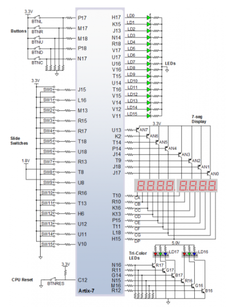

# Lab 6: Marek Černý, 230235

## Preparation tasks (done before the lab at home)

The Nexys A7 board provides five push buttons for user applications.

1. See [schematic](https://github.com/tomas-fryza/digital-electronics-1/blob/master/docs/nexys-a7-sch.pdf) or [reference manual](https://reference.digilentinc.com/reference/programmable-logic/nexys-a7/reference-manual) of the Nexys A7 board and find out the connection of these push buttons, ie to which FPGA pins are connected and how. What logic/voltage value do the buttons generate when not pressed and what value when the buttons are pressed? Draw the schematic with push buttons.



2. Calculate how many periods of clock signal with frequency of 100&nbsp;MHz contain time intervals 2&nbsp;ms, 4&nbsp;ms, 10&nbsp;ms, 250&nbsp;ms, 500&nbsp;ms, and 1&nbsp;s. Write values in decimal, binary, and hexadecimal forms.

   | **Time interval** | **Number of clk periods** | **Number of clk periods in hex** | **Number of clk periods in binary** |
   | :-: | :-: | :-: | :-: |
   | 2&nbsp;ms | 200 000 | `x"3_0d40"` | `b"0011_0000_1101_0100_0000"` |
   | 4&nbsp;ms | 400 000 | `x"6_1a80"` | `b"0110_0001_1010_1000_0000"` |
   | 10&nbsp;ms | 1 000 000 | `x"f_4240"` | `b"1111_0100_0010_0100_0000"` |
   | 250&nbsp;ms | 25 000 000 | `x"17d_7840"` | `b"0001_0111_1101_0111_1000_0100_0000"` |
   | 500&nbsp;ms | 50 000 000 | `x"2fa_f080"` | `b"0010_1111_1010_1111_0000_1000_0000"` |
   | 1&nbsp;sec | 100 000 000 | `x"5F5_E100"` | `b"0101_1111_0101_1110_0001_0000_0000"` |

<a name="part1"></a>

### Bidirectional counter

1. Listing of VHDL code of the completed process `p_cnt_up_down`. Always use syntax highlighting, meaningful comments, and follow VHDL guidelines:

```vhdl
    --------------------------------------------------------
    -- p_cnt_up_down:
    -- Clocked process with synchronous reset which implements
    -- n-bit up/down counter.
    --------------------------------------------------------
    p_cnt_up_down : process(clk)
    begin
        if rising_edge(clk) then
        
            if (reset = '1') then   -- Synchronous reset
                s_cnt_local <= (others => '0'); -- Clear all bits

            elsif (en_i = '1') then -- Test if counter is enabled

                -- TEST COUNTER DIRECTION HERE

                s_cnt_local <= s_cnt_local + 1;
            end if;
        end if;
    end process p_cnt_up_down;
```

2. Screenshot with simulated time waveforms. Test reset as well. Always display all inputs and outputs (display the inputs at the top of the image, the outputs below them) at the appropriate time scale!

   

### Two counters

1. Image of the top layer structure including both counters, ie a 4-bit bidirectional counter from *Part 4* and a 16-bit counter with a 10 ms time base from *Experiments on your own*. The image can be drawn on a computer or by hand. Always name all inputs, outputs, components and internal signals!

   
