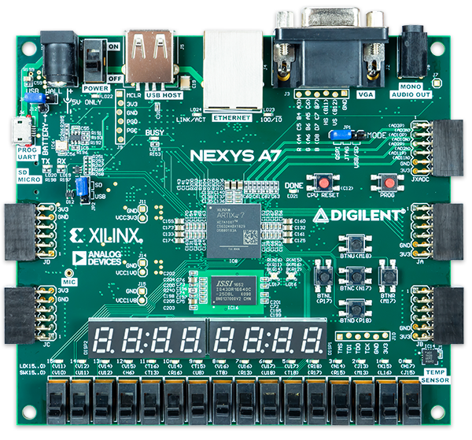
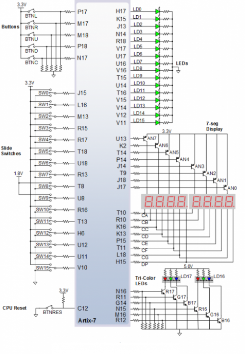
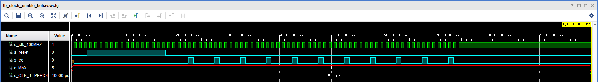
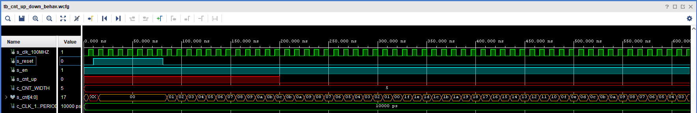
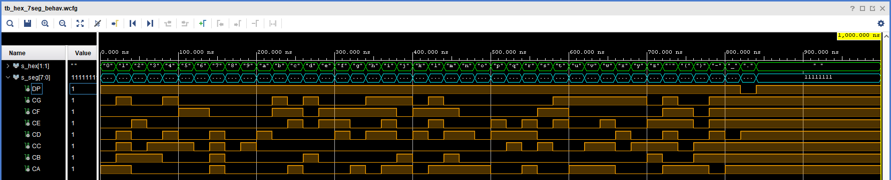
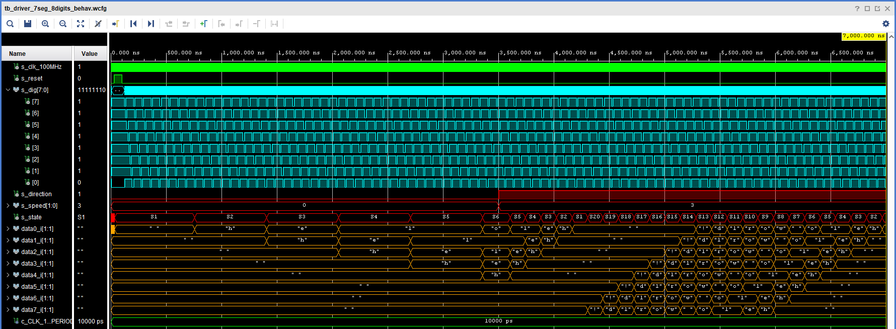
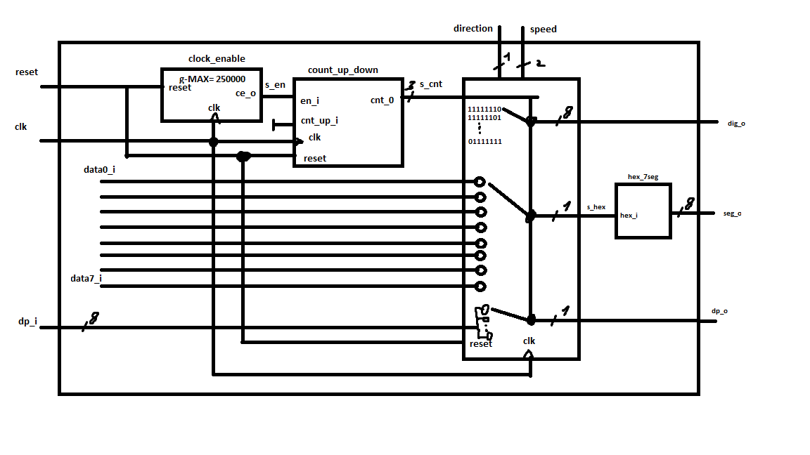

# Running text on 7-seg displays

### Team members

* Marek Černý
* Martin Borski
* Aleš Pikhart

### Table of contents

* [Project objectives](#objectives)
* [Hardware description](#hardware)
* [VHDL modules description and simulations](#modules)
* [TOP module description and simulations](#top)
* [Video](#video)
* [References](#references)

## Project objectives

Náš úkol spočíval ve vytvoření běžícího textu na sedmisegmentovém displayi, toto zadání jsme rozšířili o 4 nastavitelné rychlosti a 2 směry.

## Hardware description

Pro implementaci našeho kódu jsme použili desku nexys A7 50T. Z ní jsme využili osm displayů, první tři switche a button BTNC.

## VHDL modules description and simulations
Všechny použité moduly byly převzaty z předchozích cvičení a následně upraveny pro požadované funkce.

* [clock_enable](project/project.srcs/sources_1/new/clock_enable.vhd)

Funkcí tohoto modulu je upravit frekvenci vstupního hodinového signálu na požadovanou hodnotu. 

* [cnt_up_down](project/project.srcs/sources_1/new/cnt_up_down.vhd)

Tento modul slouží k přičítání k tříbitové hodnotě s_cnt (v simulaci čtyřbitové), která ovládá, který z osmi displayů je právě aktivní. 

* [hex_7seg](project/project.srcs/sources_1/new/hex_7seg.vhd)

Účelem tohoto modulu je transformovat vstupní jednobitový string hex_i na osmibitovou binární hodnotu seg_o představující stav katod displaye.

* [driver_7seg_8digits](project/project.srcs/sources_1/new/driver_7seg_8digits.vhd)

Tento modul propojuje veškeré předchozí hodnoty a přidává další funkce. Skládá se ze signálů v předchozích modulech, vstupních signálů speed, direction a z vnitřních signálů s_cnt2 (ovládá čas mezi jednotlivými stavy) a data0-7_i, kterým jsou přiřazovány jednobitové stringy. Dále obsahuje konstanty pro čas prodlevy mezi stavy, string obsahující až  dvanácti znakovou zprávu, která se má zobrazovat na displayích, konstantu označující nesvítící display a množinu stavů, díky kterým text rotuje. 

## TOP module description and simulations

* [top](project/project.srcs/sources_1/new/top.vhd)

Funkcí tohoto modulu je propojit signály z driver_7seg_8digits s piny na desce Nexys A7 50T. Propojuje hodinový signál, tlačítko BTNC s reset, switch(0) se signálem direction, switch(1-2) se signálem speed, signál seg_o s jednotlivými katodami a desetinnou tečkou a dig_o s AN aktivující displaye.

## Video

Write your text here

## References

1. [https://github.com/tomas-fryza/digital-electronics-1](https://github.com/tomas-fryza/digital-electronics-1)
2. [https://www.chrispurdie.com/7seg1_web](https://www.chrispurdie.com/7seg1_web)
