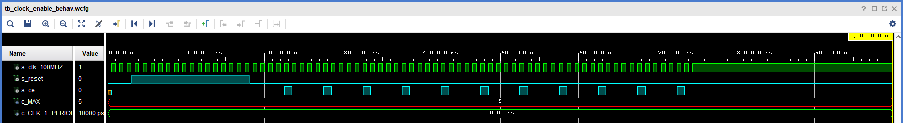
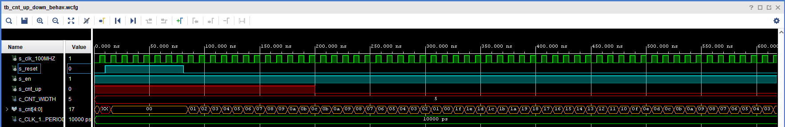
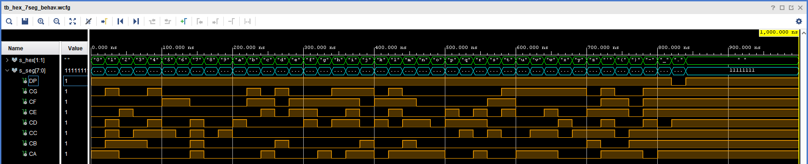
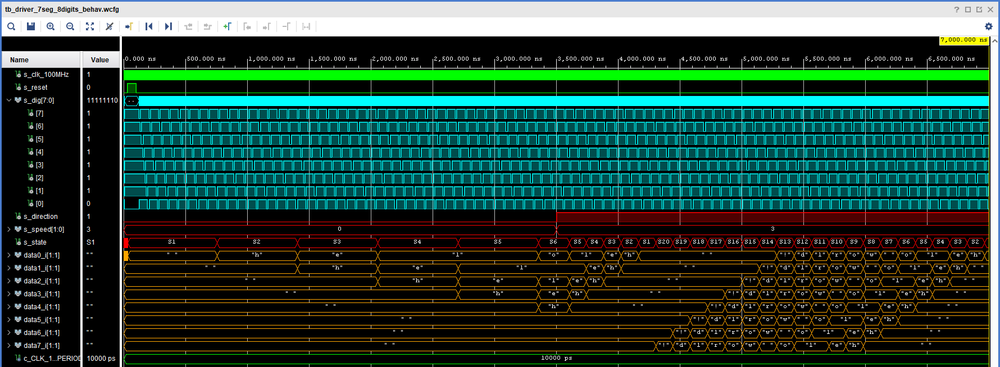

# Running text on 7-seg displays

### Team members

* Marek Černý
* Martin Borski
* Aleš Pikhart

### Table of contents

* [Project objectives](#objectives)
* [Hardware description](#hardware)
* [VHDL modules description and simulations](#modules)
* [TOP module description and simulations](#top)
* [Video](#video)
* [References](#references)

## Project objectives

Náš úkol spočíval ve vytvoření běžícího textu na sedmisegmentovém displayi, toto zadání jsme rozšířili o 4 nastavitelné rychlosti a 2 směry

## Hardware description

Write your text here.

## VHDL modules description and simulations
Všechny použité moduly byly převzaty z předchozích cvičení a následně upraveny pro požadované funkce

* clock_enable

* cnt_up_down

* hex_7seg

Účelem tohoto modulu je transformovat vstupní jednobitový string hex_i na osmibitovou binární hodnotu seg_o představující stav katod displaye.

## TOP module description and simulations

## Video

Write your text here

## References

1. Write your text here.
